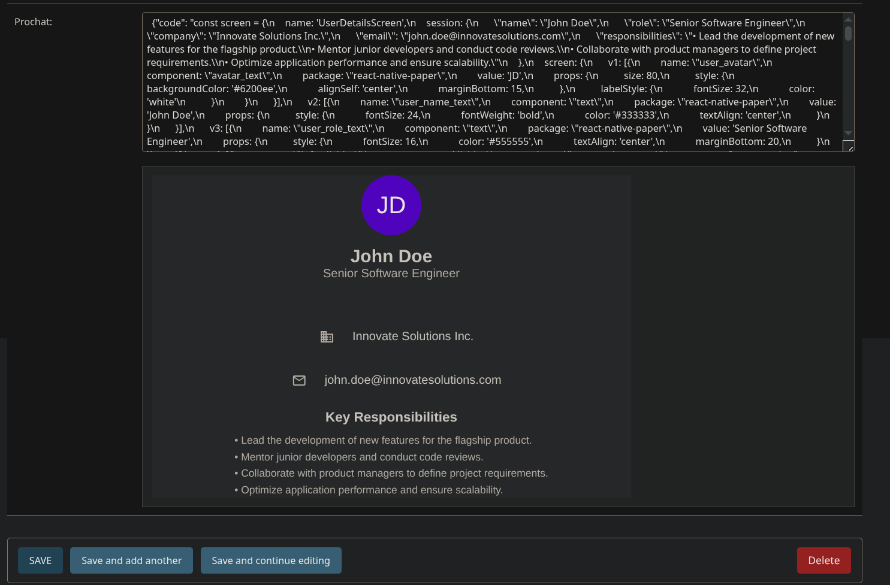

# Django Prochat

A small package to render response of [Prochat](https://prochat.dev) in Django admin panel.

## How to use?

1. Add this app to your list of installed apps.
2. in `admin.py`
```
from .models import YourModel
from django_prochat.widgets import ProchatWidget

from django import forms
from django.contrib import admin

class YourModelAdminForm(forms.ModelForm):
    class Meta:
        model = YourModel
        fields = "__all__"
        widgets = {
            "field_storing_prochat_response": ProchatWidget(),
        }

@admin.register(YourModel)
class YourModelAdmin(admin.ModelAdmin):
    form = YourModelAdminForm

```
**Note:** Field storing prochat response should be a `JsonField` and response should contain `json` key.

3. Run `python manage.py collectstatic` then start the server.

## Sample


## TODO
- [ ] Improve the UI
- [ ] Add live preview
- [ ] Parse the raw response and display in human readable format
- [ ] Let user decide how they want to store the prochat response


